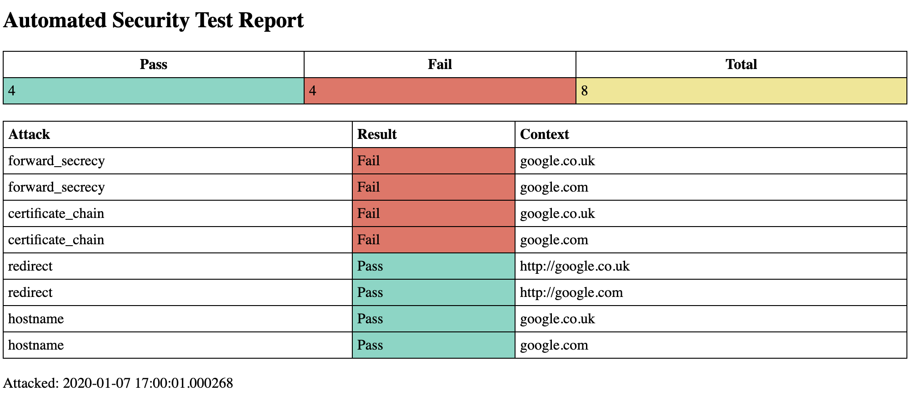

# Security Testing Framework

This framework allows for the easy development and execution of security tests.  
All tests can be packaged up in a Docker container and executed in your project build pipeline.

## Sample Security Tests

Some sample security tests have been added to demonstrate how the framework can be used.

- certificate_chain_attack - A test to verify the TLS certificate chain is valid.
- forward_secrecy_attack - A test to verify the TLS ciphers support forward secrecy.
- hostname_attack - A test to verify the certificates match the host names.
- redirect_attack - A test to verify the web server redirects port 80 requests to port 443.
- firewall_attack - A test to verify open firewall ports.

## Test Execution
 
In the end all tests should be capable of being execute via Docker.  During development tests should be executed as part of the development environment.

### Docker Execution

The tests are run via Docker by executing ./bin/attack.sh

### Local Development

In development all the tests can be run by executing attacker.py.  Environment variables will need to be set in the development environment.

### Individual Tests

Individual tests can also be executed in the development environment.  The PYTHONPATH environment variable should be added and set to the attackfiles directory.

## Report

  

